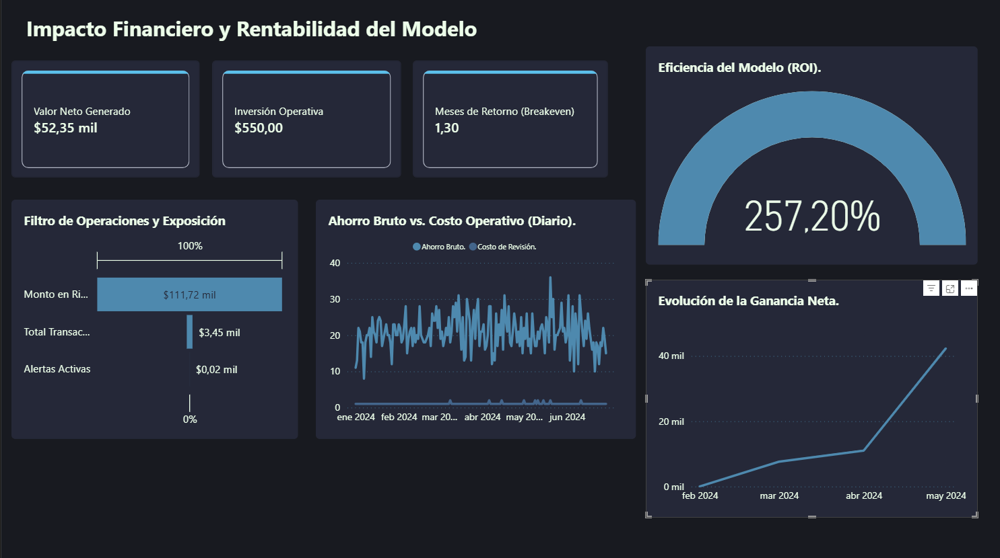
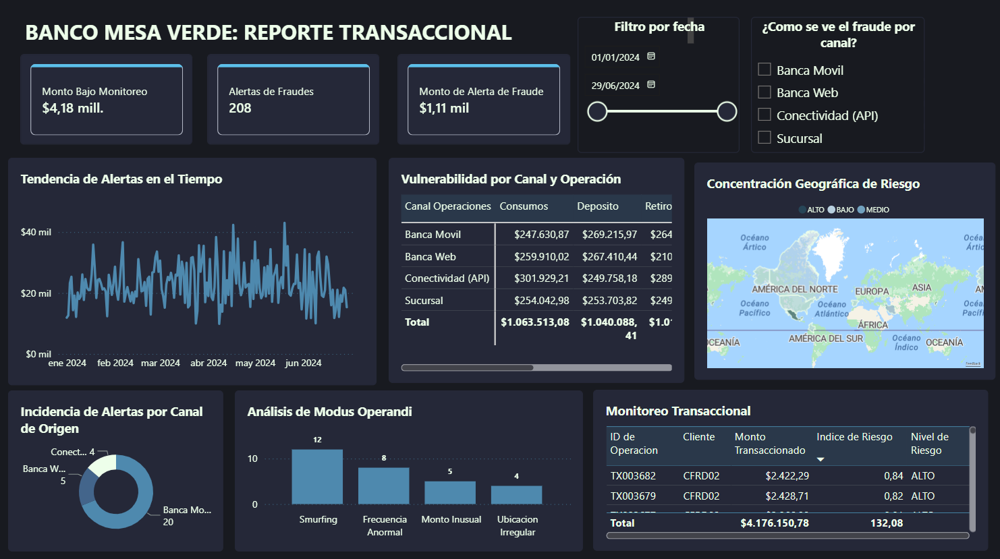

**Modelo de Inteligencia Transaccional para la Prevención de Fraude Bancario (AML)**
**Sistema que detecta transacciones sospechosas en tiempo real y reduce costos operativos en banca.**

En el sector financiero, la detección de lavado de dinero (AML) suele basarse en reglas rígidas que generan demasiados falsos positivos, lo que aumenta los costos de revisión manual.
Este proyecto propone una solución de inteligencia híbrida que combina reglas de negocio con modelos de Machine Learning para detectar patrones de fraude más complejos, como el fraccionamiento de transacciones (smurfing), con mayor precisión. Esto permite a las instituciones financieras actuar más rápido y reducir errores sin afectar a clientes legítimos.

La plataforma sustituye el enfoque tradicional basado únicamente en reglas por un sistema más avanzado que utiliza aprendizaje supervisado para identificar anomalías en las transacciones y mejorar la gestión del riesgo operativo.

**Impacto y Viabilidad Financiera**

El modelo bajo un dataset sintetico está estructurado para evaluarse estrictamente como un proyecto de inversión. El pipeline analítico calcula los siguientes indicadores de rentabilidad (PnL):
* Retorno de Inversión (ROI): 257.2%
* Período de Recuperación (Breakeven): 1.3 meses
* Optimización Operativa: Reducción de costos por horas-hombre en la revisión de falsos positivos y mitigación de fricción con clientes legítimos (control de churn).

*Tablero de rentabilidad: ROI del 257.20% y análisis de Breakeven.*
Esta captura muestra el tablero de Impacto Financiero. En ella se aprecian los KPIs de rentabilidad, la evolución de la ganancia neta y la comparativa entre el ahorro bruto generado frente al costo operativo de revisión. Demuestra la viabilidad económica del sistema.

*Monitoreo operativo: Análisis de modus operandi y vulnerabilidad por canal.*
Esta captura muestra el Reporte Transaccional. Incluye la tendencia de alertas en el tiempo, la vulnerabilidad por canal (móvil, web, API), la concentración geográfica de riesgo y un desglose de los modus operandi detectados (como Smurfing o montos inusuales).

**Arquitectura del Modelo**

El sistema opera bajo evaluación de riesgo híbrido:
1. Reglas de Negocio (40%): Evaluación de parámetros conocidos como países de alto riesgo, horarios inusuales y tipologías clásicas de fraude.
2. Machine Learning (60%): Un pipeline de clasificación basado en Gradient Boosting que analiza patrones de comportamiento histórico y desviaciones estadísticas en tiempo real.

El feature engineering manual y la ponderación del score buscan equilibrar la interpretabilidad económica exigida por las normativas de cumplimiento con la precisión estadística del modelo.

**Resultados y Desempeño**
Identificación de Patrones con alta efectividad detectando técnicas de Smurfing (fraccionamiento de transacciones) y anomalías de frecuencia.
El modelo fue calibrado para maximizar la captura de fraude real sin saturar a los analistas con alertas irrelevantes, logrando un ahorro directo por cada dólar invertido en tecnología

**Instrucciones de Ejecución**

Instalación de dependencias:
pip install -r requirements.txt

**Guía de Uso**

Ejecución del Pipeline de Datos
Para procesar la información desde cero, realizar el entrenamiento del modelo y generar las métricas financieras:

python mainpipeline0.py

Este proceso generará los archivos transactions\_scored.csv y model\_best.pkl en el directorio de datos.

**Uso en Power BI Desktop**

Utilice el script scriptpowerbi.py dentro del entorno de Power BI para cargar las tablas de hechos y dimensiones procesadas por el modelo, permitiendo la creación de tableros de control para la toma de decisiones gerenciales

**Sobre mi**
Mi nombre es Jose Luis Sanchez
Economista especializado en Analítica de Datos Consultoria y estrategia financiera.

Diseño soluciones integrales que conectan el análisis estadístico avanzado con objetivos financieros claros. Tengo experiencia desarrollando modelos predictivos, automatización de procesos mediante Python y creación de ecosistemas de datos que facilitan la toma de decisiones ejecutivas.
Estoy enfocado en posiciones de Data Analyst, Financial Analyst o Data Scientist donde pueda aplicar mi visión dual (económica y técnica) para optimizar la rentabilidad de productos digitales y financieros.
No solo desarrollo dashboards, escribo código o limpio datos, me gusta aportar ideas en base a datos, transformar información en decisiones. Mi enfoque asegura que cada solución analítica tenga impacto en el negocio, sea medible y aporte valor real a la operación en la toma de decisiones. 

**Soporte y Ayuda**
Para dudas o errores, puedes abrir un issue en este repositorio o contactar directamente conmigo en: jsanchez.eco@outlook.com

**Contribuciones**
Este proyecto forma parte de un portafolio profesional, por lo que no está orientado a contribuciones externas. Sin embargo, se agradecen sugerencias o comentarios a través de issues.

